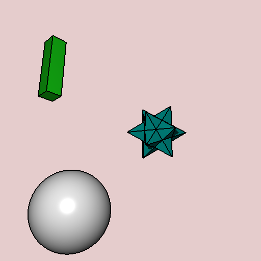

<h3>This project uses the framework from CS488 of University of Waterloo and further dive in the topic of ray tracing.</h3>
<h3>Most features are based on the discussion in textbook: <b>Fundamentals of Computer Graphics</b>, some specific implementations borrow the concept from several papers.</h3>
   
<h2>Milestones:</h2>
 

    <h3><b>013:</b></h3>
    <h4> Cool-to-warm shading(Gooch shading). Instead of using shadows, surfaces facing in one direction are shaded with a cool color and in the opposite direction are shaded with a warm color. In our implementation, we still use a light to determine the shading color: surface face to the light is shaded with a warm color.</h4>
    <h4>Concept: Section 10.3.2 from Fundamentals of Computer Graphics</h3>
    <h4>Implementation: <I>Gooch, Amy, et al. “A Non-Photorealistic Lighting Model For Automatic Technical Illustration.” Http://Www.cs.utah.edu/, University of Utah, 24 July 1998, faculty.idc.ac.il/arik/LODSeminar/07Shading/gooch-sg98.pdf.</I> </h3>
    

        
    

    <h4 style="text-align:center">The choice of warm color and cool color along with the ratio in which the materials' kd blend with these colors will affect the effect a lot! They needs to be very carefully adjusted to create a artist shading effect. </h4>

 

    <h3><b>012:</b></h3>
    <h4>Feature line drawing. It is part of the artistic shading algorithm: Cool-to-warm shading(Gooch shading). The basic idea is to draw silhouettes when adjacent ray hit different objects or there is a huge surface normal discontinuity within the same object.</h4>
    <h4>Concept: Section 10.3.1 from Fundamentals of Computer Graphics</h4>
    <h4>Implementation: <I>Choudhury, A.N.M, and Steven Parker. Ray Tracing NPR-Style Feature Lines. 1 Aug. 2009, www.sci.utah.edu/~roni/website/research/projects/NPR-lines/NPR-lines.NPAR09.pdf.</I> </h4>
    

        <h4>No feature line</h4>
        
    

    

        <h4>Feature line with width 1px</h4>
        
        <h4>Already created a good mimic of comic drawing.</h4>
    

 

    <h3><b>009:</b></h3>
    <h4>Supersampling anti-aliasing (SSAA). Using cone tracing to calculate extra smaller pixel color inside the view cone and shade with the average color. </h4>
    

        
    

    

        <h4> By specify more extra ray is calculated inside the cone and shade with these rays' average color, we could achieve better image quality. </h4>
        <h4> In this implementation, render generate 2 random within [0,1], with one determines the radius from the center and another one determine the angle from 0. Both the randoms generate with Gaussian sampling(needs improvement!) that guarantees most extra rays is within a close range to the center (try box sampling and tent sampling later).</h4>
    

    

        <h4 style="margin-top: 10%;"> No extra ray </h4>
        
    

    

        <h4 style="margin-top: 10%;"> 8 extra ray </h4>
        
    

 

    <h3><b>006:</b></h3>
    <h4> Ideal specular reflection. By modify maximum recursion depth, we can spicify how much detail is captured within reflections.</h4>
    

        <h4>Max reflection = 1</h4>
        
    

    

        <h4>Max reflection = 4</h4>
        
        <h4>From the reflection of red ball on the white ball, we can see another red ball reflection </h4>
    

 

    <h3><b>005:</b></h3>
    <h4>Basic ray tracing follows the pseudo code in section 4 of the textbook. The render uses Blinn-Phong Shading and able to cast shadow on objects.</h3>
    

        
    

